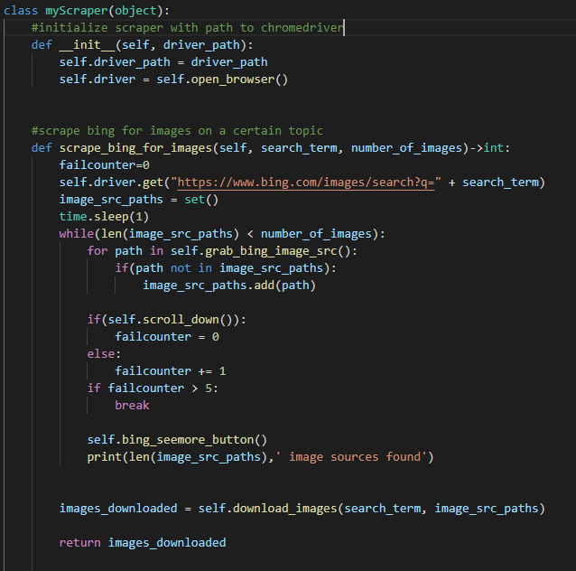

# Image Classification using Tensor Flow

## Introduction

As a milestone in completing my Machine Learning training at Talent Path, our cohort was asked to create a project to showcase our skills within the Machine Learning space. With broad agency as to what sort of technologies to build, I set out to build a project that could showcase my ability to deliver quality product in less than ideal environments. In our training I felt that there was limited amounts of instruction towards nueral networks and image classification. To showcase my ability to learn rapidly and comprehensively, I decided that Image classification would be an excellent problem to challenge.

<iframe width="560" height="315" src="https://www.youtube.com/embed/NrmMk1Myrxc" title="YouTube video player" frameborder="0" allow="accelerometer; autoplay; clipboard-write; encrypted-media; gyroscope; picture-in-picture" allowfullscreen></iframe>

My project was inspired by Amazon's Go stores that they had opened initially in Seattle, and had expanded to other locations throughout the United States. I remember seeing these stores open up and thinking of how revolutionary the technology was. In Amazon's value proposition of these stores was as follows:

> "What if we could weave the most advanced machine learning computer vision and AI into the very fabric of a store so you never have to wait in line? No lines. No checkouts. No registers."

Combining that inspiration with the practical use cases came to me while talking with Stephen Logan about how Dell operates and what we should expect in our work with Dell. Something he mentioned was that for most products that Dell creates, it will be adopted internally before being used for the consumer market. This sparked the idea to build a prototype or first steps in creating a "Dell Go" store for Dell's internal employees. Could we allow Dell employees to grab their food and go, maximizing their productiveness making use of our own machine learning and computer vision technology?

# Project Model 1: Pizza Classification

The premise of my first model was building classifiers to accurately predict whether or not each food item is present from an employee's tray. This model would be one of many binary classification models that would predict whether or not a food item was present. In this case, the model will classify True or False based on whether an employee has pizza on their tray

## Data Collection:

My first step was gathering a dataset. An important step in the data science process is gathering and manipulating the data in order to process them into manageable pieces for our machine learning models. Because the premise of this project was to build many models to classify various food items, I wanted to make sure that I was able to build a dataset myself without relying on outside sources such as Kaggle to give pre-built, manicured image set. It was important to me that I had personal control of the data collection, including what types of images were used for each of the classes within my model.

The solution for this problem came in the form of a scraper built on selenium, a popular library used for automation and testing. 

The scraper works by scrolling through an image search engine and collecting image source paths of the search result images. It then downloads them by interpreting their source paths. If the source path is a http url, it will use the request library to download the result of making a http get request to that url. That being said, not all image results are being stored as files on seperate servers. A large amount of images from these search results have images stored in base64 strings. Because of this, I wrote code that will determine if an image's source is a base64 string, and will take that string and encode an image file of the property format into the images folder storing my scraped results.

The next hurdle was that each search engine limits the amount of search results per image search. I remedied this by searching google images, bing images, and yahoo images in order to increase the amount of image results I can get per search term. Between the three search engines, I could get approximately 1800 images per search term. Additionally a failsafe that I found to be nearly exclusive to google was that they will limit results further if you scrape their site too quickly. In order to remedy that, I added extra human delay and smooth scrolling to maximize the amount of results.

From there all that was left to do was build my dataset. For pizza classification I scraped a dataset of 10,000 images. 5,000 images of pizza and 5,000 images of not pizza.

## Model Building and Training

I moved all of the images into their own directories and converted them into 180x180x3 tensors to feed into my model, using a 80-20 split between training and validation

after which, I verified that the images were correctly labeled by using matplotlib and PIL

Next I built my Sequential keras model that preprocesses the image arrays to scale their red green blue values from 0-255 to 0-1. The model alternates between convolutional layers using a `relu` activation function and pooling layers 3 times and then flattens the layers and uses a Dense layer to make its final prediction.

I compile the model using `adam` as my optimizer and `sparse categorical crossentropy` as my loss function. I then fit the model using a callback for early stopping on validation accuracy in order to maximize accuracy of my model. Additionally, the callback will restore the best weights effectively ensuring that it will maintain its highest accuracy across all epochs

After 13 epochs, the rate of my model's learning slowed down and the early stopping callback kicked in. I then compared the predictions my model made to the actual labels assigned to the images.

I found that my model worked extremely well, predicting correctly on our validation set 93% of the time. Additionally we kept strong f1 scores meaning that both are classes 0 being ``not pizza`` and 1 being ``pizza`` are well represented in the model.

taking it a step further, I used images not in the dataset to verify that the model did in fact correctly predict images as pizza and not pizza. 

The model even did well with images of food similar to pizza such as a frittata

If you want to try this model out yourself, I have it hosted in a Flask Microservice on aws ec2.

    

        <input type="text" class="form-control" placeholder="" aria-label="" aria-describedby="basic-addon1">
        

            <button class="btn btn-outline-secondary" type="button">Button</button>
        

    

<link rel="stylesheet" href="https://cdn.jsdelivr.net/npm/bootstrap@5.0.2/dist/css/bootstrap.min.css" integrity="sha384-EVSTQN3/azprG1Anm3QDgpJLIm9Nao0Yz1ztcQTwFspd3yD65VohhpuuCOmLASjC" crossorigin="anonymous">

<script type="text/javascript" src="requests.js">
